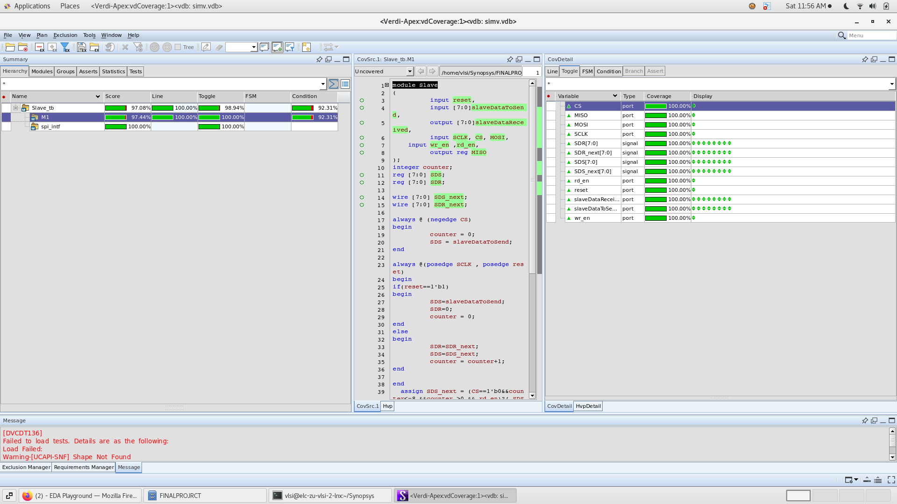
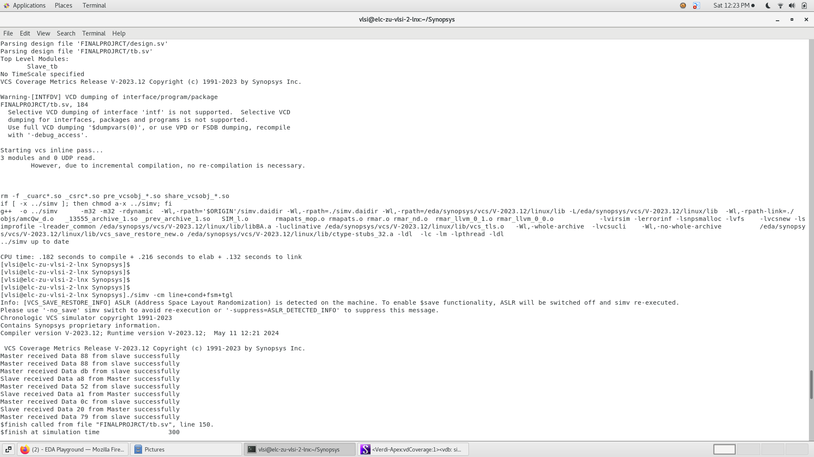
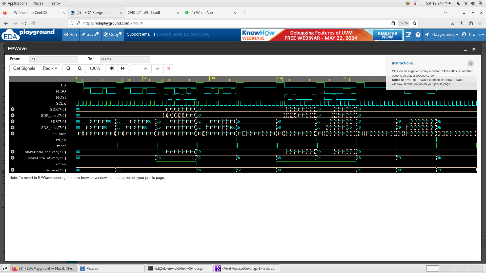
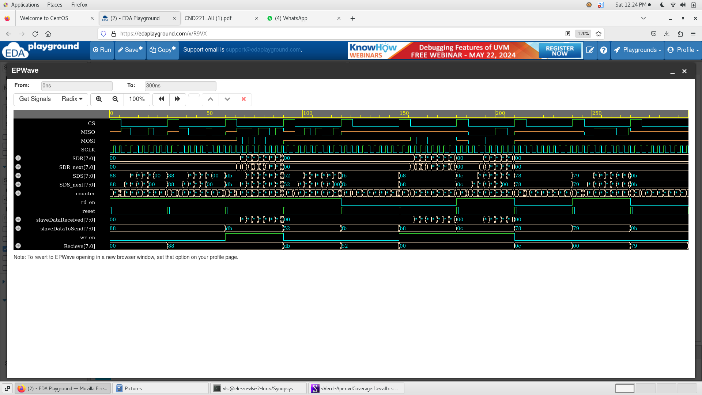
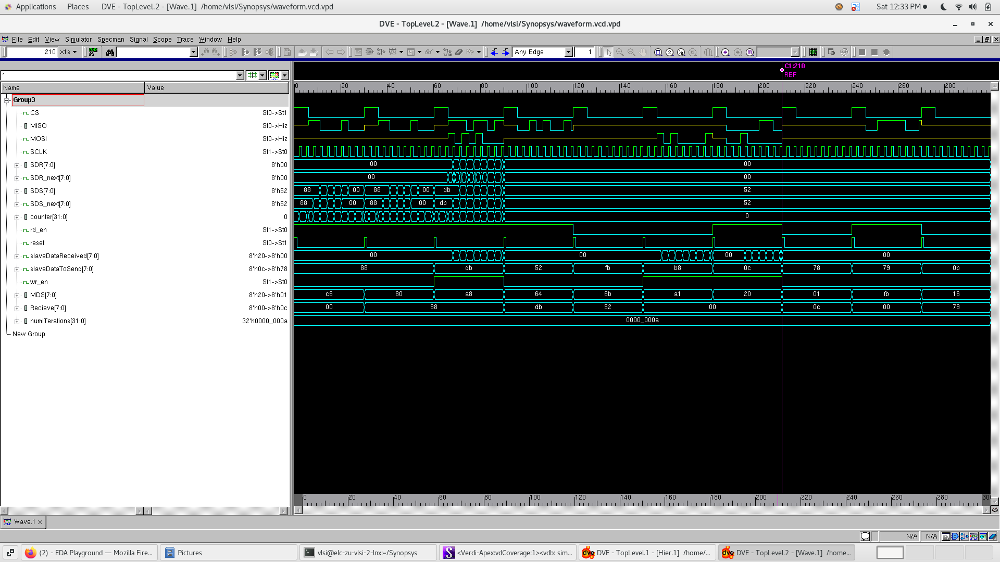
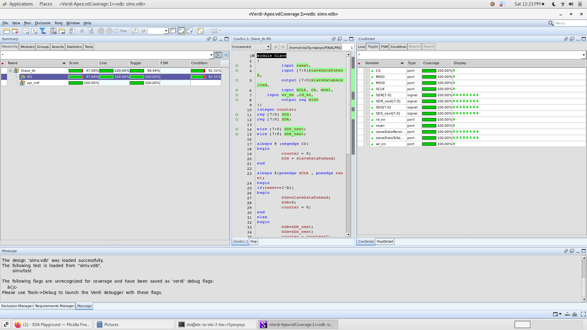

# SPI Slave Digital Verification

## Overview
This project focuses on the **verification of an SPI Slave module** using a digital verification methodology.  
The objective is to validate correct SPI communication behavior including **data reception, transmission, and protocol timing**.

The verification environment tests the SPI slave under multiple scenarios to ensure reliable operation and protocol compliance.

---

## SPI Protocol Summary

**SPI (Serial Peripheral Interface)** is a synchronous serial communication protocol commonly used in embedded systems.

It consists of four main signals:

| Signal | Description |
|------|-------------|
| SCLK | Serial clock generated by the master |
| MOSI | Master Out Slave In |
| MISO | Master In Slave Out |
| SS / CS | Slave Select |

The master initiates communication and provides the clock signal, while the slave responds during active transactions.

---

## Verification Objectives

The verification environment checks for:

- Correct **data shifting on MOSI**
- Proper **data transmission on MISO**
- Accurate **clock edge sampling**
- Correct **Slave Select (SS) handling**
- Stability across **multiple SPI transactions**

---

## Simulation Results

---

## Verification Report

For a detailed explanation of the design and verification process, see the full report:

📄 [SPI Verification Report](report/spi_verification_report.pdf)

The report includes:

- SPI protocol overview
- RTL design description
- Testbench architecture
- Simulation results
- Waveform analysis
- Verification conclusions
- Coverage on all signals/ports

---

## Tools Used

- VCS   (Synopsys) 
- Verdi (Synopsys)
- DVE   (Synopsys
- EDA Playground
---

## Conclusion

The SPI slave module was verified through multiple simulation scenarios.  
Results confirm that the design operates correctly and follows the SPI communication protocol.
